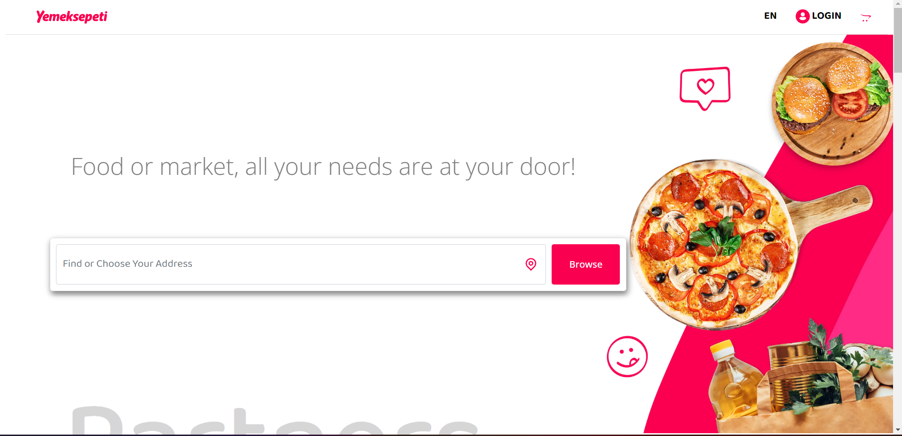
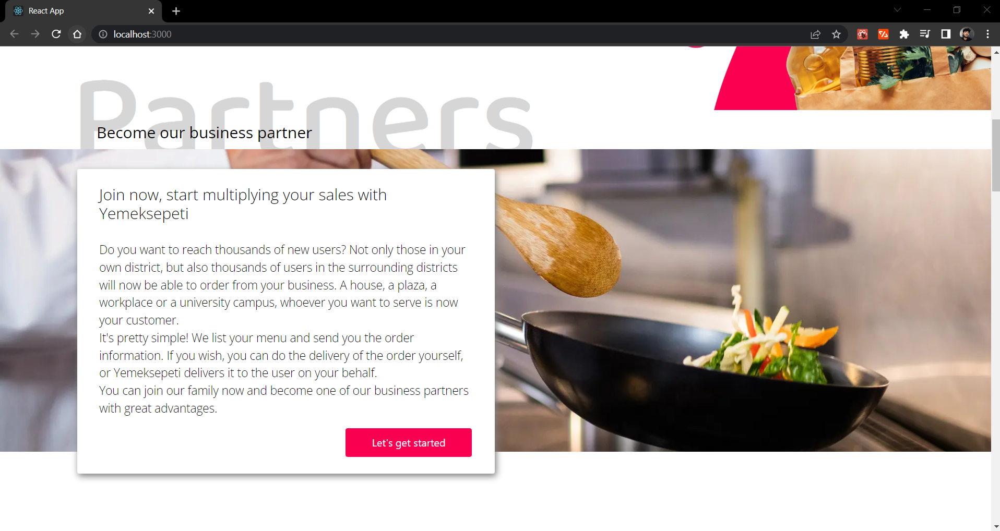
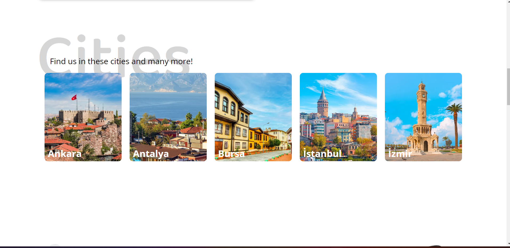
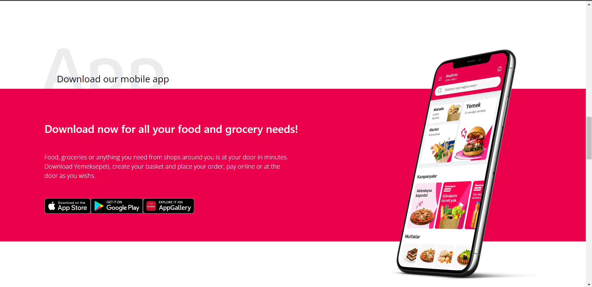
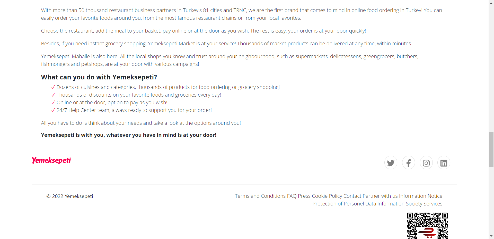
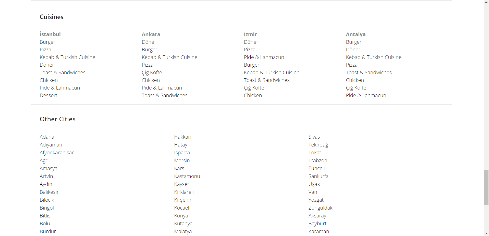
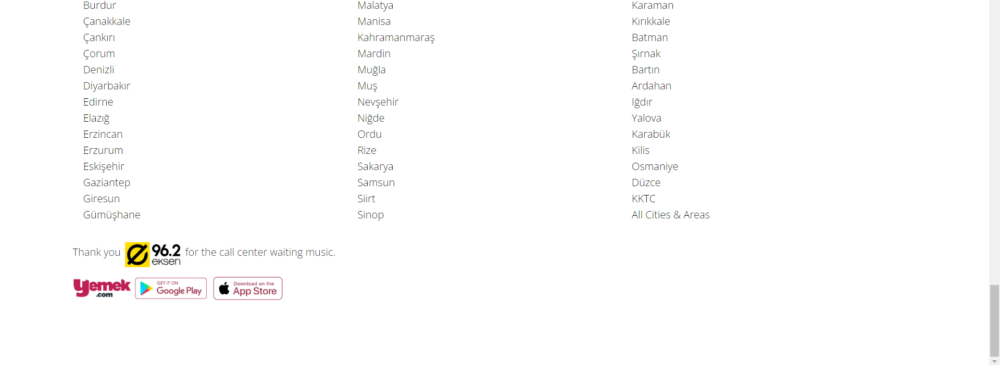

## YemekSepetiApp-try React.js
[demo](https://yemeksepetiapp.vercel.app/)
Hello , my name is ayhan , In this article, I will tell you about a work I did with react.js.The structure I use in my project is only the component structure. I started learning and developing the reactjs library from the day I discovered it. it is very tasteful and its structure is very nice , in general its structure goes from part to whole in a master structure . and it's actually very useful, very nice and easy to understand.

*A sample project I made, an experiment and an example project inspired by the web application of #yemeksepeti Thank you to #yemeksepeti
## App-images

